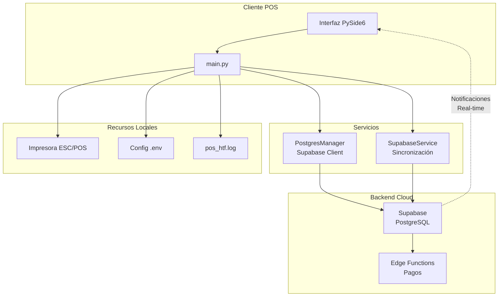
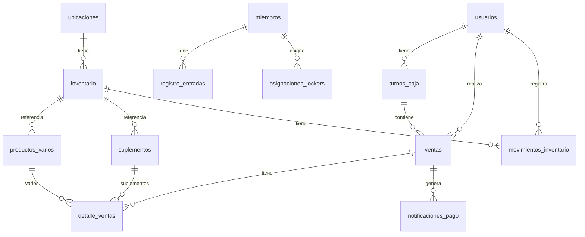
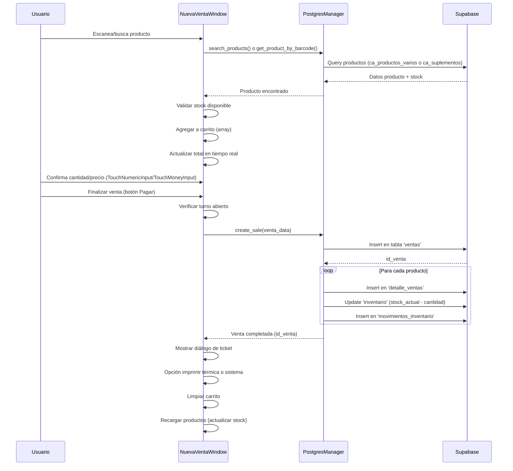
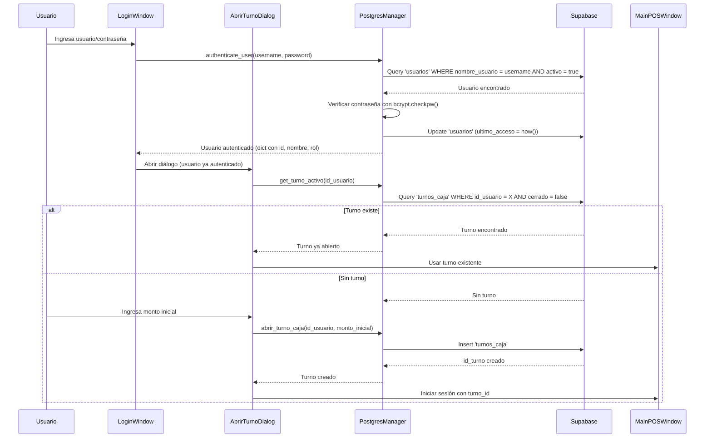
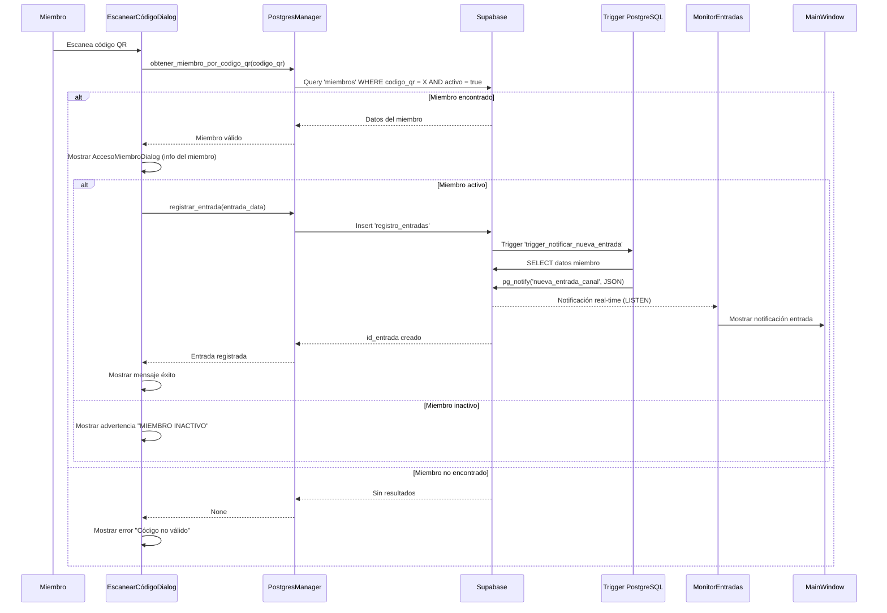
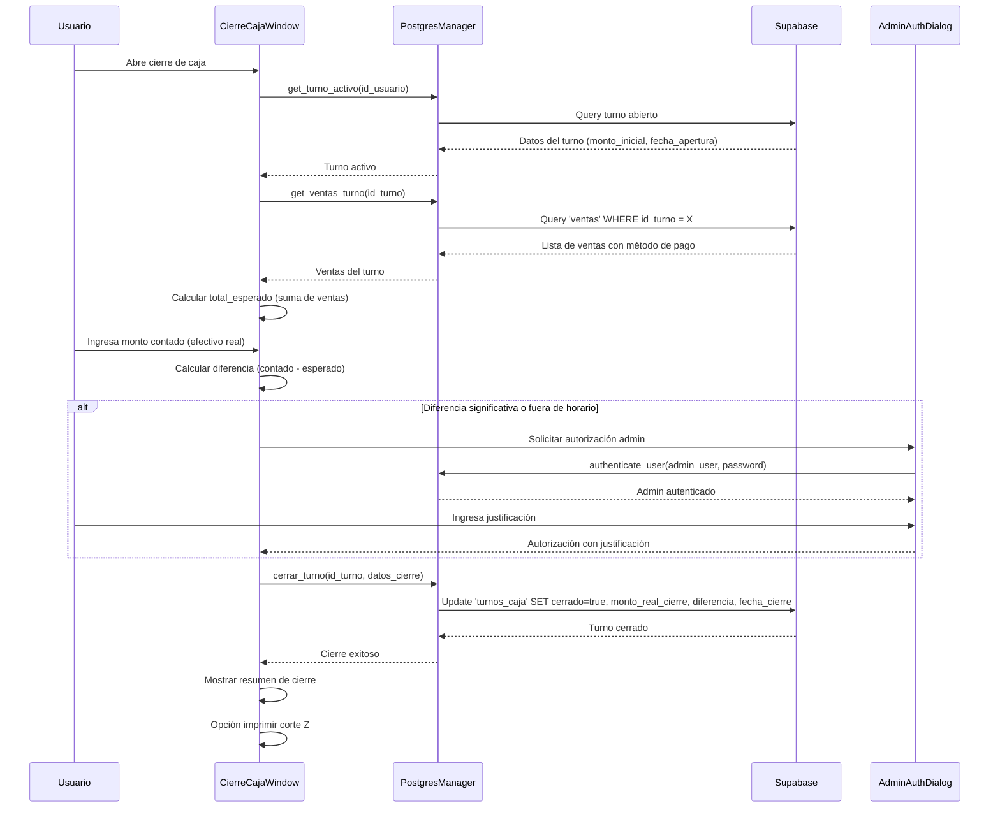

# Documentación Técnica Completa - Sistema POS HTF Gimnasio

## 1. Visión General del Proyecto

El **HTF Gimnasio POS** es un sistema completo de punto de venta diseñado específicamente para gimnasios, con arquitectura híbrida que combina PostgreSQL en la nube (a través de Supabase) para operaciones en tiempo real y sincronización con aplicaciones móviles.

### Tecnologías Principales

- **Frontend**: PySide6 (Qt6) - Interfaz optimizada para pantallas táctiles
- **Backend**: Supabase (PostgreSQL en la nube) como base de datos principal
- **Arquitectura**: Backend único en Supabase - **Requiere conexión a Internet para funcionar** (no hay modo offline implementado)
- **Empaquetado**: PyInstaller para generar ejecutable Windows (.exe ~85MB)
- **Impresión**: ESC/POS para impresoras térmicas
- **Seguridad**: bcrypt para hashing de contraseñas, Row Level Security (RLS) en Supabase

## 2. Arquitectura del Sistema

### 2.1 Flujo de Datos Principal



### 2.2 Estructura de Módulos

```
POS-HTF/
├── main.py                          # Punto de entrada, gestión de aplicación Qt
├── requirements.txt                 # Dependencias Python
├── .env                            # Variables de entorno (Supabase, PostgreSQL)
│
├── database/
│   ├── postgres_manager.py         # Gestor principal de BD (Supabase client)
│   └── postgres_manager_old.py     # Versión anterior (backup)
│
├── services/
│   └── supabase_service.py         # Servicio de sincronización y consultas
│
├── ui/                             # Interfaz de usuario completa
│   ├── main_pos_window.py          # Ventana principal con navegación
│   ├── components.py               # Sistema de diseño (Tiles, TouchInputs)
│   ├── login_window_pyside.py      # Autenticación de usuarios
│   ├── abrir_turno_dialog.py       # Diálogo para abrir turno de caja
│   │
│   ├── ventas/                     # Módulo de ventas
│   │   ├── nueva_venta.py          # Proceso completo de venta
│   │   ├── ventas_dia.py           # Reporte de ventas del día
│   │   ├── historial.py            # Histórico completo de ventas
│   │   └── cierre_caja.py          # Cierre de turno con corte Z
│   │
│   ├── inventario_window.py        # Gestión de inventario
│   ├── nuevo_producto_window.py    # Formulario de creación de productos
│   ├── movimiento_inventario_window.py  # Registro de movimientos
│   ├── editable_catalog_grid.py    # Grid editable para catálogo masivo
│   ├── ubicaciones_window.py       # Gestión de ubicaciones de almacén
│   │
│   ├── acceso_miembro_dialog.py    # Diálogo de acceso de miembros
│   ├── buscar_miembro_window.py    # Búsqueda de miembros
│   ├── escanear_codigo_dialogo.py  # Escáner de códigos QR
│   ├── historial_acceso_window.py  # Historial de accesos
│   │
│   ├── lockers_window.py           # Gestión de lockers
│   ├── asignar_locker_window.py    # Asignación de lockers
│   │
│   ├── asignacion_turnos_window.py # Asignación de turnos a empleados
│   ├── historial_turnos_window.py  # Historial de turnos
│   │
│   ├── notificaciones_pago_window.py      # Notificaciones de pagos
│   ├── confirmar_pago_efectivo_dialog.py  # Confirmación de pagos
│   ├── pagos_efectivo_window.py          # Gestión de pagos
│   ├── notificacion_entrada_widget.py     # Widget de notificaciones
│   ├── notification_detail_modal.py       # Modal de detalles
│   │
│   ├── personal_window.py          # Gestión de personal
│   ├── admin_auth_dialog.py        # Autenticación de administrador
│   ├── dias_festivos_window.py     # Gestión de días festivos
│   └── sales_windows.py            # Ventanas auxiliares de ventas
│
├── utils/
│   ├── config.py                   # Configuración y variables de entorno
│   └── monitor_entradas.py         # Monitor de entradas en tiempo real
│
├── escpos_printer.py               # Integración impresora térmica ESC/POS
├── windows_printer_manager.py      # Gestor de impresoras del sistema
│
└── assets/
    ├── pos_icono.png               # Icono principal
    └── pos_icono.ico               # Icono Windows
```

## 3. Funcionalidades Principales

### 3.1 Sistema de Ventas

**Nueva Venta** (`ui/ventas/nueva_venta.py`):
- Carrito de compras en tiempo real
- Búsqueda rápida por código de barras o nombre
- Validación de stock antes de agregar
- Cálculo automático de totales
- Múltiples métodos de pago (efectivo, tarjeta, transferencia)
- Impresión de tickets (térmica y sistema)

**Gestión de Turnos** (`ui/abrir_turno_dialog.py`):
- Apertura de turno con monto inicial
- Validación de turno activo antes de ventas
- Cierre de turno con reporte detallado
- Control de diferencias de caja
- Autorización de administrador para cierres fuera de horario

**Cierre de Caja** (`ui/ventas/cierre_caja.py`):
- Corte Z con cálculo de diferencias
- Desglose por método de pago
- Monto esperado vs. monto real
- Autorización para diferencias significativas
- Registro completo de operaciones

### 3.2 Gestión de Inventario

**Productos**:
- Catálogo de productos varios y suplementos
- Creación y edición de productos
- Códigos de barras y códigos internos
- Categorías y características (refrigeración, peso, etc.)

**Stock**:
- Control de inventario en tiempo real
- Alertas de stock bajo
- Actualización automática al realizar ventas
- Grid editable para gestión masiva

**Movimientos**:
- Registro de entradas/salidas
- Historial completo de movimientos
- Trazabilidad por usuario y fecha
- Tipos de movimiento: venta, entrada, salida, ajuste

**Ubicaciones**:
- Gestión de almacenes y secciones
- Asignación de productos a ubicaciones
- Búsqueda por ubicación

### 3.3 Gestión de Miembros

**Registro**:
- Alta de miembros con datos completos
- Generación de códigos QR únicos
- Información de contacto y membresía
- Estado activo/inactivo

**Accesos**:
- Escaneo de QR para entrada rápida
- Registro automático de fecha y hora
- Monitoreo en tiempo real con notificaciones
- Historial completo de accesos

**Lockers**:
- Gestión de casilleros disponibles
- Asignación temporal o permanente
- Seguimiento de asignaciones activas

**Historial**:
- Compras por miembro
- Asistencias y frecuencia
- Pagos y mensualidades

### 3.4 Pagos Digitales

**Notificaciones**:
- Sistema de notificaciones para pagos pendientes
- Códigos de pago únicos (CASH-XXX)
- Actualización en tiempo real del estado

**Confirmación**:
- Escaneo de códigos QR para confirmar pagos en efectivo
- Integración con Edge Functions de Supabase
- Actualización automática del estado de ventas

## 4. Base de Datos (Supabase/PostgreSQL)

### 4.1 Tablas Principales



### 4.2 Tablas Clave y Descripción

**Autenticación y Usuarios**:
- `usuarios`: Información de usuarios del sistema (admin, cajeros, recepcionistas)
  - Campos: id_usuario, nombre_usuario, contrasenia (bcrypt), nombre_completo, rol, activo

**Control de Caja**:
- `turnos_caja`: Turnos de trabajo de los cajeros
  - Campos: id_turno, id_usuario, monto_inicial, fecha_apertura, fecha_cierre, cerrado
  - Relación: Un usuario puede tener múltiples turnos

**Ventas**:
- `ventas`: Encabezado de ventas
  - Campos: id_venta, id_usuario, id_turno, id_miembro (opcional), fecha, subtotal, descuento, impuestos, total, metodo_pago, tipo_venta, estado
- `detalle_ventas`: Detalle de productos vendidos
  - Campos: id_detalle, id_venta, codigo_interno, tipo_producto, cantidad, precio_unitario, subtotal_linea, nombre_producto

**Productos e Inventario**:
- `ca_productos_varios`: Catálogo de productos varios
- `ca_suplementos`: Catálogo de suplementos
- `inventario`: Control de stock
  - Campos: id_inventario, codigo_interno, tipo_producto, stock_actual, stock_minimo, id_ubicacion, seccion, activo
- `movimientos_inventario`: Historial de movimientos
  - Campos: id_movimiento, codigo_interno, tipo_movimiento, cantidad, stock_anterior, stock_nuevo, id_usuario, id_venta (opcional)

**Miembros y Accesos**:
- `miembros`: Información de miembros del gimnasio
  - Campos: id_miembro, nombres, apellidos, telefono, email, codigo_qr, activo, fecha_registro
- `registro_entradas`: Historial de accesos
  - Campos: id_entrada, id_miembro, tipo_acceso, fecha_entrada, area_accedida, dispositivo_registro

**Lockers**:
- `lockers`: Catálogo de lockers disponibles
- `asignaciones_lockers`: Asignaciones activas de lockers a miembros

**Ubicaciones**:
- `ca_ubicaciones`: Ubicaciones de almacén (almacenes, secciones)

**Notificaciones**:
- `notificaciones_pago`: Notificaciones de pagos pendientes
  - Campos: id_notificacion, id_venta, codigo_pago, estado, fecha_creacion

### 4.3 Triggers y Notificaciones

**LISTEN/NOTIFY**:
- Canal: `nueva_entrada_canal`
- Trigger: `trigger_notificar_nueva_entrada` en tabla `registro_entradas`
- Función: `notificar_nueva_entrada()` - Envía notificación JSON con datos del miembro y entrada
- Uso: Actualización en tiempo real de entradas de miembros en la interfaz

**Configuración**:
- Script: `setup_postgres_trigger.sql`
- Ejecutar en Supabase SQL Editor para habilitar notificaciones

## 5. Sistema de Diseño UI

### 5.1 Componentes Táctiles Personalizados

**TouchNumericInput** (`ui/components.py`):
- Campo numérico sin flechas pequeñas (▲▼)
- Altura mínima 50px para fácil uso táctil
- Validación de rangos (minimum, maximum)
- Teclado numérico automático en tablets
- Uso: Cantidad de productos, stock, etc.

**TouchMoneyInput** (`ui/components.py`):
- Campo monetario con formato automático ($)
- Validación de decimales (configurable)
- Prefijo de moneda
- Uso: Precios, montos, totales

**TileButton** (`ui/components.py`):
- Botones grandes estilo Windows Phone Tiles
- Altura mínima 160px, ancho mínimo 200px
- Colores vibrantes configurables
- Efectos hover y pressed
- Iconos FontAwesome integrados

**InfoTile** (`ui/components.py`):
- Widget informativo con valores principales y secundarios
- Icono destacado
- Colores por sección
- Uso: Dashboards, resúmenes

**SearchBar** (`ui/components.py`):
- Barra de búsqueda con icono integrado
- Placeholder personalizable
- Estilo Windows Phone

### 5.2 Paleta de Colores Windows Phone

**Colores Primarios**:
- PRIMARY_BLUE: `#1e3a8a` (Azul HTF)
- BG_BLACK: `#000000`
- BG_LIGHT: `#f5f5f5`

**Colores de Tiles**:
- TILE_RED: `#e51400`
- TILE_GREEN: `#00a300`
- TILE_ORANGE: `#ff8c00`
- TILE_PURPLE: `#9b59b6`
- TILE_BLUE: `#0078d7`
- TILE_TEAL: `#00aba9`
- TILE_MAGENTA: `#e3008c`
- TILE_GRAY: `#B39DDB`

**Navegación por Colores**:
- Ventas: Rojo
- Inventario: Verde
- Miembros: Naranja
- Admin: Púrpura
- Config: Gris

### 5.3 Navegación

**MainPOSWindow** utiliza un sistema de pestañas con:
- StackedWidget para cambiar entre páginas
- Barra de navegación inferior fija (140px altura)
- Barra superior con información de usuario (70px altura)
- Navegación táctil optimizada

## 6. Flujos de Trabajo Principales

### 6.1 Flujo de Venta



### 6.2 Flujo de Apertura de Turno



### 6.3 Flujo de Entrada de Miembro



### 6.4 Flujo de Cierre de Caja



## 7. Integraciones y Servicios

### 7.1 Impresora ESC/POS

**Archivo**: `escpos_printer.py`

**Protocolo**: ESC/POS estándar (Epson Standard Code for Point Of Sale)

**Conexión**: Puerto Serial COM (USB a Serial)

**Configuración**:
- Puerto predeterminado: COM3 (configurable)
- Baudrate: 115200 bps
- Ancho papel: 58mm (42 caracteres por línea)

**Clases Principales**:
- `EscPosDriver`: Clase base para comunicación con impresora
  - Métodos: conectar(), desconectar(), alinear_centro(), fuente_grande(), negrita_on(), cortar_papel(), abrir_caja_registradora()
- `TicketPrinter`: Especializada para imprimir tickets
  - Métodos: imprimir_titulo_tienda(), imprimir_encabezado_ticket(), imprimir_producto(), imprimir_total(), imprimir_ticket()

**Uso en Nueva Venta**:
```python
from escpos_printer import TicketPrinter

printer = TicketPrinter(puerto="COM3")
datos_ticket = {
    'tienda': 'HTF GIMNASIO',
    'numero_ticket': venta_id,
    'fecha_hora': datetime.now().strftime('%d/%m/%Y %H:%M'),
    'cajero': user_data['nombre_completo'],
    'productos': carrito,
    'total': total_venta,
    'metodo_pago': 'EFECTIVO'
}
printer.imprimir_ticket(datos_ticket)
```

**Documentación**: Ver `INTEGRACION_IMPRESORA_ESCPOS.md`

### 7.2 Supabase

**Archivo**: `database/postgres_manager.py`, `services/supabase_service.py`

**Conexión**:
- Cliente: `supabase-py` (Python client)
- URL y Key desde variables de entorno (.env)
- Service Role Key para bypasear RLS en operaciones administrativas

**Configuración (.env)**:
```env
SUPABASE_URL=https://xxxxx.supabase.co
SUPABASE_KEY=eyJhbGciOiJIUzI1NiIs...  # Anon key
SUPABASE_ROLE_KEY=eyJhbGciOiJIUzI1NiIs...  # Service role key (bypasea RLS)
```

**PostgresManager**:
- Clase principal para todas las operaciones de base de datos
- Métodos organizados por secciones:
  - Autenticación (authenticate_user, create_user)
  - Productos (get_all_products, search_products, get_product_by_barcode)
  - Ventas (create_sale, get_ventas_turno)
  - Inventario (obtener_inventario_completo, actualizar_stock)
  - Miembros (obtener_miembro_por_codigo_qr, registrar_entrada)
  - Turnos (abrir_turno_caja, cerrar_turno, get_turno_activo)

**SupabaseService**:
- Servicio adicional para sincronización
- Métodos auxiliares: get_total_members(), get_lockers_status(), etc.

**Row Level Security (RLS)**:
- Habilitado en Supabase
- Service Role Key permite operaciones administrativas
- Anon Key respeta políticas RLS

### 7.3 Configuración

**Archivo**: `utils/config.py`

**Variables de Entorno**:
- Carga desde `.env` en raíz del proyecto
- Soporte para ejecutables PyInstaller (busca .env en directorio del .exe)

**Configuración Principal**:
- Database path (SQLite legacy - código no utilizado, solo referencias en config.py)
- Supabase URL y Keys
- PostgreSQL config (legacy, ahora solo Supabase)
- App name y version
- Colores del tema UI

**Métodos**:
- `get_postgres_config()`: Retorna dict con configuración de Supabase
- `validate_config()`: Valida que las variables requeridas estén presentes

### 7.4 Logging

**Archivo**: `main.py` (configuración), logs en `pos_htf.log`

**Configuración**:
```python
logging.basicConfig(
    level=logging.INFO,
    format='%(asctime)s - %(levelname)s - %(message)s',
    handlers=[
        logging.FileHandler('pos_htf.log', encoding='utf-8'),
        logging.StreamHandler(sys.stdout)
    ]
)
```

**Niveles**:
- INFO: Operaciones normales, conexiones exitosas
- WARNING: Situaciones recuperables, datos no encontrados
- ERROR: Errores que requieren atención

**Encoding UTF-8**:
- Configurado para Windows (stdout/stderr)
- Soporte para caracteres especiales en logs

## 8. Seguridad y Autenticación

### 8.1 Autenticación de Usuarios

**Hashing de Contraseñas**:
- Algoritmo: bcrypt
- Salt automático generado
- Almacenamiento: Campo `contrasenia` en tabla `usuarios`

**Proceso de Login**:
1. Usuario ingresa username y password
2. Sistema busca usuario en BD por `nombre_usuario`
3. Verifica que usuario esté activo (`activo = true`)
4. Compara password con `bcrypt.checkpw()`
5. Si correcto, actualiza `ultimo_acceso`
6. Retorna datos del usuario (id, nombre, rol)

**Roles**:
- `administrador`: Acceso completo, puede autorizar cierres de caja
- `recepcionista`: Operaciones de recepción y ventas
- `sistemas`: Mantenimiento técnico

### 8.2 Autorización de Administrador

**Uso**: Operaciones sensibles que requieren autorización adicional

**Ejemplo - Cierre de Caja**:
- Si cierre fuera de horario o con diferencia significativa
- Sistema solicita autenticación de administrador
- Diálogo: `AdminAuthDialog`
- Requiere: username de admin, password, justificación
- Justificación se guarda en notas del cierre

### 8.3 Row Level Security (RLS)

**Configuración en Supabase**:
- Políticas RLS definidas en Supabase Dashboard
- Service Role Key bypasea RLS (usado en PostgresManager)
- Anon Key respeta políticas (uso futuro para app móvil)

### 8.4 Validaciones

**Turnos**:
- No se pueden realizar ventas sin turno abierto
- Un usuario solo puede tener un turno abierto a la vez
- Validación en cada venta: `verificar_turno_abierto()`

**Stock**:
- Validación de stock antes de agregar a carrito
- Validación nuevamente al confirmar venta
- Actualización atómica del stock

**Miembros**:
- Validación de miembro activo antes de registrar entrada
- Validación de código QR único

## 9. Características Especiales

### 9.1 Dependencia de Conexión a Internet

**Estado Actual**:
- ⚠️ **El sistema requiere conexión a Internet para funcionar**
- Todas las operaciones dependen de Supabase (autenticación, ventas, inventario, etc.)
- Si falla la conexión a Supabase, `PostgresManager.connect()` lanza excepción
- En `main.py`, si la conexión falla, `postgres_manager = None` y la aplicación no puede funcionar
- No hay implementación de modo offline ni cache local

**Código Legacy (No Utilizado)**:
- Existe archivo `database/pos_htf.db` (SQLite) pero **no se usa en el código**
- Referencias a `DATABASE_PATH` en `config.py` son código legacy
- Mensajes sobre "modo offline" en el código son engañosos - solo warnings, no funcionalidad real

**Comportamiento Actual**:
- Si Supabase no está disponible, la aplicación muestra warnings pero **no puede realizar operaciones**
- No es posible hacer login, ventas, o cualquier operación sin conexión

**Implementación Futura Necesaria para Modo Offline**:
- Cache local de productos y miembros (SQLite o similar)
- Cola de operaciones pendientes para sincronizar cuando conexión esté disponible
- Sincronización bidireccional cuando conexión se restablece
- Validación local de operaciones críticas

### 9.2 Optimización Táctil

**Principios de Diseño**:
1. **Campos Grandes**: Altura mínima 50px en todos los inputs
2. **Sin Elementos Pequeños**: No flechas en spinboxes, botones grandes
3. **TouchNumericInput**: Campo numérico sin flechas, teclado numérico automático
4. **TouchMoneyInput**: Campo monetario con formato automático
5. **TileButton**: Botones grandes estilo Windows Phone (160px+ altura)
6. **Espaciado Generoso**: Márgenes y padding amplios

**Navegación**:
- Barra de navegación inferior fija (fácil acceso con pulgar)
- Pestañas grandes y coloridas
- Gestos táctiles intuitivos

**Teclado**:
- InputMode configurado para mostrar teclado numérico en tablets
- Placeholders claros
- Validación en tiempo real

### 9.3 Monitoreo en Tiempo Real

**Sistema LISTEN/NOTIFY**:

**Configuración** (`setup_postgres_trigger.sql`):
```sql
CREATE OR REPLACE FUNCTION notificar_nueva_entrada()
RETIGGERS plpgsql AS $$
BEGIN
    PERFORM pg_notify('nueva_entrada_canal', payload_json);
    RETURN NEW;
END;
$$;

CREATE TRIGGER trigger_notificar_nueva_entrada
AFTER INSERT ON registro_entradas
FOR EACH ROW
WHEN (NEW.tipo_acceso = 'miembro')
EXECUTE FUNCTION notificar_nueva_entrada();
```

**Implementación** (`utils/monitor_entradas.py`):
- Clase `MonitorEntradas` que se suscribe al canal
- Conexión PostgreSQL directa (no Supabase client, usa psycopg2)
- Escucha notificaciones en background thread
- Emite señales Qt cuando recibe notificación
- MainWindow muestra widget de notificación

**Uso**:
- Notificaciones aparecen automáticamente cuando un miembro entra
- Widget muestra nombre del miembro y hora
- Click para ver detalles completos
- Sin necesidad de recargar o hacer polling

## 10. Puntos de Entrada Principales

### 10.1 main.py

**Clase**: `POSApplication`

**Responsabilidades**:
- Inicializar aplicación Qt (`QApplication`)
- Cargar configuración (`Config`)
- Inicializar PostgresManager y SupabaseService
- Mostrar ventana de login
- Manejar flujo de autenticación y apertura de turno
- Gestionar ciclo de vida de MainWindow

**Flujo**:
```
main.py (__main__)
  └─> POSApplication.__init__()
      ├─> QApplication(sys.argv)
      ├─> Config()
      ├─> PostgresManager(db_config)
      ├─> SupabaseService()
      └─> show_login()
          └─> LoginWindow.show()
              └─> [Usuario hace login]
                  └─> on_login_success()
                      ├─> verificar_turno_abierto()
                      ├─> AbrirTurnoDialog (si no hay turno)
                      └─> show_main_window()
                          └─> MainPOSWindow.show()
```

### 10.2 LoginWindow

**Archivo**: `ui/login_window_pyside.py`

**Funcionalidad**:
- Formulario de login (username, password)
- Validación de campos
- Llamada a `PostgresManager.authenticate_user()`
- Emisión de señal `login_success` con datos del usuario

### 10.3 AbrirTurnoDialog

**Archivo**: `ui/abrir_turno_dialog.py`

**Funcionalidad**:
- Verificar si usuario ya tiene turno abierto
- Si no, solicitar monto inicial
- Crear turno con `PostgresManager.abrir_turno_caja()`
- Retornar `turno_id` para usar en ventas

### 10.4 MainPOSWindow

**Archivo**: `ui/main_pos_window.py`

**Responsabilidades**:
- Ventana principal con navegación
- Sistema de pestañas (StackedWidget)
- Barra superior con info de usuario
- Barra inferior de navegación
- Inicializar monitor de entradas
- Gestionar widgets de notificaciones

**Páginas**:
1. Ventas (índice 0)
2. Inventario (índice 1)
3. Miembros (índice 2)
4. Admin (índice 3)
5. Config (índice 4)

### 10.5 NuevaVentaWindow

**Archivo**: `ui/ventas/nueva_venta.py`

**Responsabilidades**:
- Interfaz de punto de venta
- Búsqueda de productos
- Gestión de carrito
- Cálculo de totales
- Procesamiento de venta
- Impresión de tickets

**Componentes Clave**:
- Campo de búsqueda (barcode o nombre)
- Grid de productos disponibles
- Tabla de carrito
- Área de totales y métodos de pago
- Botones de acción (Pagar, Cancelar, Limpiar)

## 11. Archivos de Configuración Importantes

### 11.1 .env

**Ubicación**: Raíz del proyecto

**Variables Requeridas**:
```env
# Supabase
SUPABASE_URL=https://xxxxx.supabase.co
SUPABASE_KEY=eyJhbGciOiJIUzI1NiIs...  # Anon key
SUPABASE_ROLE_KEY=eyJhbGciOiJIUzI1NiIs...  # Service role key (recomendado)

# PostgreSQL (legacy, no se usa actualmente pero se lee)
DB_HOST=localhost
DB_PORT=5432
DB_NAME=htf_gimnasio
DB_USER=postgres
DB_PASSWORD=password
```

**Nota**: En ejecutables PyInstaller, el .env debe estar en el mismo directorio que el .exe

### 11.2 requirements.txt

**Dependencias Principales**:
```
PySide6>=6.6.0              # Framework UI Qt6
QtAwesome>=1.4.0            # Iconos FontAwesome
python-dotenv>=1.0.0        # Variables de entorno
supabase>=2.0.0             # Cliente Supabase
psycopg2-binary>=2.9.0      # Driver PostgreSQL (para LISTEN/NOTIFY)
pyinstaller>=6.0.0          # Generar ejecutable
customtkinter>=5.2.2        # UI alternativa (opcional)
openpyxl>=3.11.0            # Excel
pandas>=2.0.0               # Manipulación de datos
xlsxwriter>=3.1.2           # Excel avanzado
```

### 11.3 setup_postgres_trigger.sql

**Propósito**: Configurar triggers de notificaciones en Supabase

**Uso**: Ejecutar en Supabase SQL Editor

**Contenido**:
- Función `notificar_nueva_entrada()`
- Trigger `trigger_notificar_nueva_entrada`
- Configuración de canal `nueva_entrada_canal`

### 11.4 build_exe.py / build_onedir.py / build_simple.py

**Propósito**: Scripts para generar ejecutable con PyInstaller

**build_exe.py**: Configuración completa con iconos y recursos
**build_onedir.py**: Genera directorio con ejecutable y dependencias
**build_simple.py**: Generación simple de un solo archivo

**Configuración**:
- Icono: `assets/pos_icono.ico`
- Nombre: HTF_Gimnasio_POS.exe
- Tamaño aproximado: 85-90 MB

## 12. Estado del Proyecto

### 12.1 Completado ✅

**Sistema de Ventas**:
- ✅ Nueva venta con carrito
- ✅ Búsqueda por código de barras
- ✅ Múltiples métodos de pago
- ✅ Impresión de tickets (térmica y sistema)
- ✅ Histórico de ventas
- ✅ Reporte de ventas del día
- ✅ Cierre de caja con corte Z

**Gestión de Inventario**:
- ✅ Catálogo de productos (varios y suplementos)
- ✅ Control de stock en tiempo real
- ✅ Movimientos de inventario
- ✅ Alertas de stock bajo
- ✅ Grid editable para gestión masiva
- ✅ Ubicaciones de almacén

**Gestión de Miembros**:
- ✅ Registro completo de miembros
- ✅ Escaneo QR para entrada
- ✅ Monitoreo en tiempo real de entradas
- ✅ Historial de accesos
- ✅ Gestión de lockers

**Sistema de Turnos**:
- ✅ Apertura de turno con monto inicial
- ✅ Validación de turno antes de ventas
- ✅ Cierre de turno con reporte
- ✅ Control de diferencias de caja
- ✅ Autorización de administrador

**UI y Diseño**:
- ✅ Componentes táctiles optimizados
- ✅ Sistema de diseño Windows Phone
- ✅ Navegación intuitiva
- ✅ Paleta de colores coherente

**Integraciones**:
- ✅ Impresora térmica ESC/POS
- ✅ Supabase como backend
- ✅ Notificaciones en tiempo real (LISTEN/NOTIFY)
- ✅ Sistema de logging

### 12.2 Mejoras Futuras 🚀

**Mencionadas en Código/Documentación**:
- GUI de configuración de impresora (actualmente se edita código)
- Múltiples copias de tickets
- Reportes avanzados con gráficas
- App de administración web
- Soporte multi-sucursal
- API REST para integraciones
- Implementación de modo offline real con cache local y sincronización bidireccional (actualmente no implementado)

**Sugerencias Técnicas**:
- Tests unitarios e integración
- Documentación de API
- CI/CD para builds automáticos
- Docker containerización
- Mejoras en manejo de errores
- Internacionalización (i18n)

## 13. Guías de Desarrollo

### 13.1 Agregar Nueva Funcionalidad

**Pasos Recomendados**:
1. Diseñar esquema de BD si requiere nuevas tablas
2. Agregar métodos en `PostgresManager` para operaciones de BD
3. Crear componente UI en `ui/` usando componentes del sistema de diseño
4. Integrar en `MainPOSWindow` si es una nueva sección
5. Agregar logging apropiado
6. Probar con datos reales
7. Documentar cambios

### 13.2 Modificar Componentes del Sistema de Diseño

**Archivo**: `ui/components.py`

**Componentes Principales**:
- `WindowsPhoneTheme`: Paleta de colores y constantes
- `TileButton`: Botones estilo tile
- `TouchNumericInput`: Input numérico táctil
- `TouchMoneyInput`: Input monetario táctil
- `InfoTile`: Widget informativo
- `SearchBar`: Barra de búsqueda
- Funciones de estilos: `apply_windows_phone_stylesheet()`

**Al Modificar**:
- Mantener altura mínima 50px en inputs táctiles
- Usar colores de `WindowsPhoneTheme`
- Probar en pantalla táctil si es posible
- Actualizar documentación si cambia API pública

### 13.3 Debugging

**Logs**:
- Revisar `pos_htf.log` para errores
- Nivel INFO muestra operaciones normales
- Nivel ERROR muestra problemas críticos

**Conexión a Supabase**:
- Verificar variables en `.env`
- Probar conexión con script simple:
```python
from supabase import create_client
client = create_client(url, key)
response = client.table('usuarios').select('*').limit(1).execute()
print(response.data)
```

**Impresora**:
- Verificar puerto COM en Device Manager
- Probar con `test_impresora.py` si existe
- Revisar que drivers estén instalados

## 14. Referencias y Recursos

**Documentación Externa**:
- [PySide6 Documentation](https://doc.qt.io/qtforpython/)
- [Supabase Python Client](https://github.com/supabase/supabase-py)
- [ESC/POS Command Reference](https://reference.epson-biz.com/modules/ref_escpos/)
- [bcrypt Documentation](https://github.com/pyca/bcrypt/)

**Archivos de Documentación del Proyecto**:
- `README.md`: Documentación general del usuario
- `INTEGRACION_IMPRESORA_ESCPOS.md`: Guía de impresora térmica
- `setup_postgres_trigger.sql`: Configuración de triggers
- `DOCUMENTACION_TECNICA.md`: Este documento

---

**Última Actualización**: Diciembre 2024  
**Versión del Sistema**: 1.0.0  
**Mantenido por**: Equipo de Desarrollo HTF

